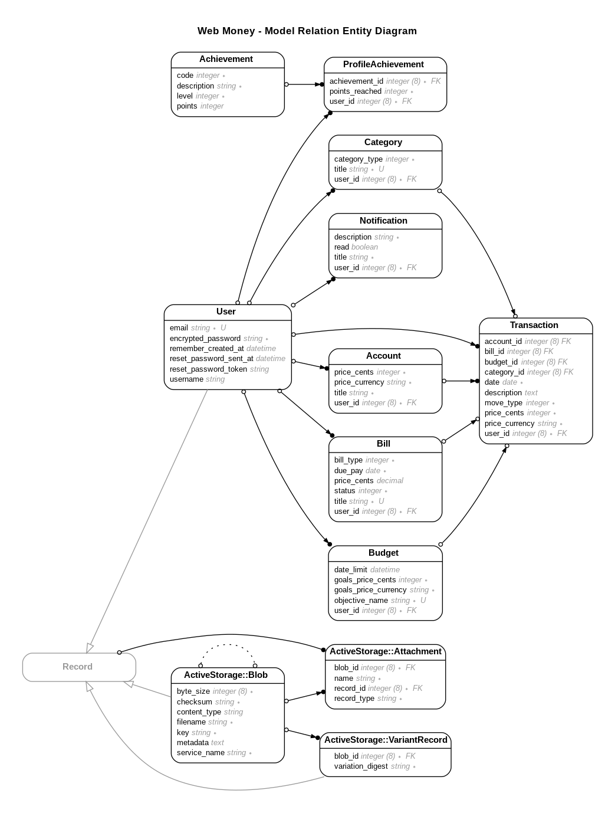

# Web Money - Gestão de Finanças Pessoais

## Descrição

Web Money é um sistema financeiro onde os usuários podem adicionar
suas despesas ou receitas, registrar transações e acompanhar suas
movimentações diariamente. Dividindo os registros em diferentes categorias,
como também demonstrando cálculos pertinentes à movimentação
utilizando-se de gráficos e tabelas.

O objetivo principal do sistema é ser uma plataforma capaz de auxiliar o
acompanhamento da própria saúde financeira dos usuários, o planejamento de
metas financeiras e desbloqueio de conquistas conforme estiver avançando
nos seus planos e no uso do sistema.

## Próximos passos

* Adicionar configuração de notificação de Pag. Recorrentes
* O sistema deve deixar uma notificação padrão de Pag. Recorrente para 1 dia antes do vencimento
* Relatórios de movimentações
* Exportação / Importação de planilhas (Movimentações)

## Dependências

* ruby 3.0.6
* rails 6.0.1
* Postgre SQL 12.1
* Bootstrap 4.3.1
* Chartkick and groupdate for charts
* Fontawesome 4.6.3

## Construindo projeto

Instale as dependências do projeto

~~~bash
  bundle install
~~~

Gerar as tabelas do banco de dados

~~~bash
  rails db:setup
~~~

## Rodando projeto

~~~bash
  rails s -p 3000
~~~

### Usando docker

~~~bash
  rails s
  docker compose up web
~~~

## Rodando os testes

~~~bash
  rspec
~~~

* Se quiser rodar testes especificos você pode passar o caminho da pasta com os testes que deve rodar

~~~bash
  rspec spec/models   # Testes unitarios
  rspec spec/requests # Testes de Integração
  rspec spec/services # Testes dos Services Objects
~~~

Docs [Rspec-rails](https://rspec.info/features/6-0/rspec-rails/)

* Para ver o relatorio de cobertura de testes, execute os testes primeiro e depois rode o comando abaixo

~~~bash
  xdg-open coverage/index.html
~~~

Docs [Simplecov](https://github.com/simplecov-ruby/simplecov)

### Testes E2E com Cypress

~~~bash
  yarn cypress install
~~~

~~~bash
  yarn cypress open
~~~

Docs [Cypress](https://docs.cypress.io/guides/getting-started/opening-the-app)

### Executando os testes no Docker

~~~bash
  docker compose up web
  docker compose run --rm rspec
  docker comopose run --rm rspec spec/<path>
~~~

## Gerando documentação

~~~bash
  yardoc
  yard server
~~~

Docs [Yard](https://yardoc.org/)

## Modelagem do Banco de Dados

## Author

Angeliano Sousa [LinkedIn](https://www.linkedin.com/in/angeliano-sousa/)
