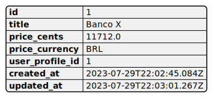

# accounts

## Descrição da classe

O que essa classe faz ?
Qual seu objetivo ?

## Campos
["id", "title", "price_cents", "price_currency", "user_profile_id", "created_at", "updated_at"]

## Funcionalidades

* Contexto em que é útil
* Como o usuário interage com ela

