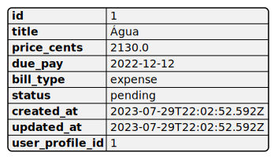

# bills

## Descrição da classe

O que essa classe faz ?
Qual seu objetivo ?

## Campos
["id", "title", "price_cents", "due_pay", "bill_type", "status", "created_at", "updated_at", "user_profile_id"]

## Funcionalidades

* Contexto em que é útil
* Como o usuário interage com ela

