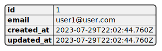

# users

## Descrição da classe

O que essa classe faz ?
Qual seu objetivo ?

## Campos
["id", "email", "encrypted_password", "reset_password_token", "reset_password_sent_at", "remember_created_at", "created_at", "updated_at"]

## Funcionalidades

* Contexto em que é útil
* Como o usuário interage com ela

